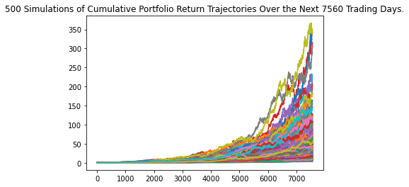
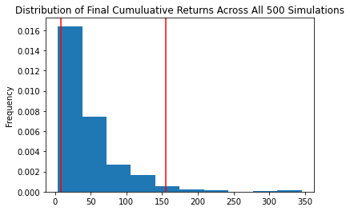

# Budget Retirement Planner
A tool that provides examples of how to use Alpaca API and Monte Carlo simulations to model budgeting and retirement plan options.

## Technologies

In this project we are utilizing Python 3, Jupyter Lab, and the Pandas Library.  We also leveraged the Alpaca API to retrieve historical stock data and ran Monte Carlo simulations to project out future earnings.  

Pandas library -- Incredibly useful Python library for data science and data analysis  
Jupyter Lab -- Robust environment to be able to view and edit devopment projects in a streamlined system.  
Alpaca API -- a free to use API that allows for the retrieval of market data, trading interactions, and other market utilizations.  
Monte Carlo simulations are run utilizing the Python library named MCForecastTools.  All relevant information is contained with the MCForecastTools.py file included in this repository.  

---

## Installation Guide

* Pandas -- The source code is currently hosted on GitHub at: https://github.com/pandas-dev/pandas

Binary installers for the latest released version are available at the Python Package Index (PyPI) and on Conda.

### conda
`conda install pandas`
### or PyPI
`pip install pandas`

* Jupyter Lab -- 
    [Link for detailed instructions on installing Jupyter Lab here.](https://jupyter.org/install)  
    
* Alpaca API -- You can visit [their website](https://alpaca.markets/) for instructions on how to get API keys and for documentation on how to use it.  
    
## Dependencies:  

import os -- allows for .env variable retrieval from a hidden .env file  

import requests -- allows for API calls and retrieval of information  

import json -- formatting data received from API calls into readable json objects  

import pandas as pd  

from dotenv import load_dotenv -- allows for loading of .env variables  

import alpaca_trade_api as tradeapi -- ability to interact with Alpaca's API  

from MCForecastTools import MCSimulation -- imports from MCForecastTools.py to run Monte Carlo simulations

%matplotlib inline  


---

## Usage

## The first part of the project is geared towards retrieving data from a cryptocurrency API and using that information to calculate portfolio value

### Here we get the quote data on Ethereum and Bitcoin by using the free crypto api endpoints:  

```python
btc_url = "https://api.alternative.me/v2/ticker/Bitcoin/?convert=USD"
eth_url = "https://api.alternative.me/v2/ticker/Ethereum/?convert=USD"  

The above API call returns the following JSON object --  

* {
    "data": {
        "1": {
            "circulating_supply": 18854312,
            "id": 1,
            "last_updated": 1635197860,
            "max_supply": 21000000,
            "name": "Bitcoin",
            "quotes": {
                "USD": {
                    "market_cap": 1191571036912,
                    "percent_change_1h": 0.226475418653854,
                    "percent_change_24h": 3.217162128751,
                    "percent_change_7d": 2.5357745031666,
                    "percentage_change_1h": 0.226475418653854,
                    "percentage_change_24h": 3.217162128751,
                    "percentage_change_7d": 2.5357745031666,
                    "price": 63145.0,
                    "volume_24h": 31170243562
                }
            },
            "rank": 1,
            "symbol": "BTC",
            "total_supply": 18854312,
            "website_slug": "bitcoin"
        }
    },
    "metadata": {
        "error": null,
        "num_cryptocurrencies": 3105,
        "timestamp": 1635197860
    }
}  
```

We can then access the price data we are looking for by drilling down into the returned JSON object using the following code:  


`btc_price = btc_response['data']['1']['quotes']['USD']['price']`  *(These same steps can be repeated for the Ethereum quote)

Next we compute the value of the crypto assets in the client's portfolio, and then add the ethereum and btc totals together to get the total wallet value --  

` 
btc_value = btc_price * btc_coins  
total_crypto_wallet = btc_value + eth_value `  

### We use the Alpaca API to retrieve stock and bond market data and then calculate the value of our client's stocks/bonds portfolio:  

*Create the alpaca object after retrieving our API and Secret keys from our .env files --  

`alpaca_api_key = os.getenv('ALPACA_API_KEY')  
alpaca_secret_key = os.getenv('ALPACA_SECRET_KEY')`

`alpaca = tradeapi.REST(
    alpaca_api_key,
    alpaca_secret_key,
    api_version='v2')`  
    
*Set the parameters for the API call:  

`tickers = ['SPY', 'AGG']  
timeframe = '1D'  
start_date = pd.Timestamp('2021-10-22', tz = 'America/New_York').isoformat()
end_date = pd.Timestamp('2021-10-22', tz = 'America/New_York').isoformat()`

*Execute the API call:  

`stock_prices_df = alpaca.get_barset(
    tickers,
    timeframe,
    start = start_date,
    end = end_date).df`  
    
*Notice by adding 'df' to the end of our API call, Alpaca automatically converts the return data to a Pandas DataFrame

### Once we have isolated the closing prices from the returned stock and bond DataFrame, we can add our the value of our client's stocks and bonds (total shares * returned closing values) to the value of their crypto wallet and generate a pie chart illustrating their overall holdings --  

`savings_df.plot.pie(y='amount', title = 'Pie chart of percentage of portfolio containing stocks/bonds and crypto wallet')
`


### Once we know the value of our client's total portfolio, we can use a if/else statement to evaluate whether it meets our established savings threshold --  

`if total_portfolio > emergency_fund:
    print('Congratulations, you have enough for an emergency fund!')
elif total_portfolio == emergency_fund:
    print('Congratulations, you reached your emergency fund goal!')
else:
    print('Keep going, you are (emergency_fund - total_portfolio) away from completing your goal')`

### We can use our historical stock data from the Alpaca API to run Monte Carlo simulations to project out potential future earnings over a set amount of time.  We do this by utilizing an instance of the MCSimulation class we imported from MCForecastTools:  

`MC_thirty_years = MCSimulation(
    portfolio_data = historical_df,
    weights = [0.4, 0.6],
    num_simulation = 500,
    num_trading_days = 252 * 30)` *-- notice we passed in the portfolio dataframe from the Alpaca API call, the weights that we wanted each stock to hold in our portfolio, the number of simulations and the total number of trading days for 30 years.  
    
Once the simulation has been run, we can plot cumulative portfolio trajectories and the distribution of returns among the simulations we ran --  

`MC_thirty_years.plot_simulation()`  

  

`MC_thirty_years.plot_distribution()`  

  

We can then run summary statistics for our simulation, and based on these results calculate our upper and lower bound return values based on our 95% confidence interval:  

`MC_summary_stats = MC_thirty_years.summarize_cumulative_return()`  

count           500.000000  
mean             47.454609  
std              44.152059  
min               4.066270  
25%              19.949052  
50%              35.121870  
75%              59.554398  
max             345.257869 
**95% CI Lower  7.882472**  
**95% CI Upper  155.088206**  
Name: 7560, dtype: float64

With all of these plots and summary statistics, we can then evaluate our clients ability to retire given a certain time frame, portfolio, and the balance of their portfolio and its impact on future earnings.


## License

Licensed under the [MIT License](https://github.com/git/git-scm.com/blob/main/MIT-LICENSE.txt)  Copyright 2021 Dave Thomas.

